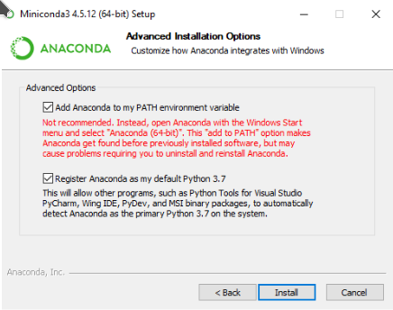

# Homework 01

The deadline of this homework is on **Tuesday, 12th of April, 00:00:00 UTC+2**.

## 1. Overview

The purpose of this homework is mainly to make sure that you have the necessary tools to complete future homeworks. For that, we need to make sure that the following are set up correctly:

1. Your online GitHub account (if you read this, you already have completed this step)
2. Your local [Git](https://git-scm.com/) installation
3. Your local [Conda](https://docs.conda.io/en/latest/) installation (this enables you to use Python and install packages)
4. Your local copy (called *clone*) of this repository

In order to complete this assignment, you need to be able to run command-line instructions in your terminal. If you are not yet
comfortable with using command-line instructions, you may want to look up a tutorial like [this one](https://ubuntu.com/tutorials/command-line-for-beginners) or [this one](https://www.codecademy.com/learn/learn-the-command-line). Keep in mind that the command-line may work slightly different for each operating system - the linked tutorials are targeted at users of a Unix systems (Linux/Mac), which we highly recommend for this course.

In the following, if you are asked to *run* a command like

```
run this command
```

it means that you should type `run this command` in the terminal and press <kbd>Enter</kbd>.

## 2. Installing Git

### For Ubuntu Linux

Open a terminal and run

    $ sudo apt-get install git

### For Mac

Install Homebrew if you don't have it already from https://brew.sh/. Then run

    $ brew install git

### For Windows

Download the `.exe` from https://git-scm.com/download/win and run the installer.

In the install wizard, make sure that git **can** be used from the command prompt, otherwise you'd have to switch between shells when coding and committing to git.To make sure your solution will be accepted once pushed, you need to set one of the two *commit unix style* options. Other than that, you'll probably go for the *openSSL* as well as *Windows default console as terminal emulator* options.

## 3. Installing Conda

Download the correct installer for your system from https://docs.conda.io/en/latest/miniconda.html. This will depend on your operating system and whether your have a 32-bit or 64-bit system (on Linux, this can be determined by running ``$ getconf LONG_BIT``). Choose a Python version that is 3.7 or higher.

### For Ubuntu Linux and Mac OS

To start the installer, navigate to the place where you downloaded the file to in the terminal and run

```bash
bash Miniconda3-latest-Linux-x86_64.sh
```
and for Mac OS

```bash
bash Miniconda3-latest-MacOSX-x86_64.sh
```

If the file you downloaded is named differently, type that file name after ``bash`` instead.

Most options can just be answered with yes, however you should insist on adding `conda` to your PATH if the installer asks you.

### For Windows

Start the graphical installer, it should guide through the installation process. If you don't have another Python installation already installed, you can safely add Python to your %PATH%, such that you can use it from your normal `cmd`-shell.



In any case, you should have a program named "Anaconda prompt" installed afterward, which you can find with the start menu. If you didn't add it to your %PATH% as instructed above, you need to run all `conda`-commands in the Anaconda prompt, otherwise you can use the normal `cmd`. Make sure to not use the `PowerShell`, as some conda-commands won't work properly there.

If you decide to use an environment later on, make sure you have admin rights for the terminal you use. To do that, hit <kbd>Win</kbd> type `cmd`, right-click the first option `Command Prompt`, and select `Open as Administrator`. Before you continue the installation process, you need to update conda in order to install the environment. Do so by using the command

```bash
conda update conda
```
    
### Testing your Conda and Python installations

Check that you now have a working Conda installation by running

    $ conda --version
    
Check that you now have a working Python installation by running

    $ python --version
    
If the Python version shown is 3.8 or higher, you were successful! In some cases, the version number shown will start with 2 rather than 3 - you should then use the command ``python3`` instead of ``python`` for the remainder of this course. If you decide to use a conda environment later on, check this again after activating it.


## 4. Cloning the repository

Next, we want to use ``git`` to clone this repository (which you are probably viewing online on GitHub right now) to a local folder on your system. 

The simplest way to do this is via the ``https`` protocol by copying the url of your personal GitHub repository page for this assignment - it will follow the schema ``https://github.com/scientificprogrammingUOS/2021-homework01-<YOUR-USERNAME>/``. Experienced GitHub users can also use the ``ssh`` protocol instead.

When you have your URL, navigate to the directory where you want to put your homework, then run

```bash
git clone <URL>
```
    
You may now be prompted for your GitHub username and password.

## 5. Completing this homework

### Setting everything up for this homework

The following commands assume that you are located in the cloned repository folder.

1. **Recommended**: Create a new conda environment called ``scipy`` for this course by running ``$ conda create -n scipy python``. You can usally agree to the proposed package initialization. Whenever you work on a homework for this course, first activate your environment by running `` $ conda activate scipy``.

2. Run `` $ pip install -r requirements.txt`` to install the required packages for this homework. If you had to use ``python3`` earlier, you may need to use ``pip3`` instead of ``pip`` now. If you are not using a conda environment, you may have to install ``pip`` first, e.g. by running `` $ sudo apt install python3-pip`` on Ubuntu Linux.

3. Run `` $ pytest``. This is supposed to fail, which is indicated by red text. Your job in this (and all future homeworks) is to change the ``.py`` files in this repository that do **not** start with ``test_`` in such a way that running `` $ pytest`` succeeds.

### Solving this homework

1. Open the file ``hello_world.py`` with your favourite text editor or IDE, e.g. VS Code or Jupyter Lab. Jupyter Lab can be installed by running `` $ conda install -c conda-forge jupyterlab``.
*We recommend you install JupyterLab globally on your machine. Otherwise you will have to install it for every environment. To install JupyterLab globally be sure to deactivate any active virtual environment before running the command.*
 
2. Look for a predefined function. Its docstring (the text surrounded by triple quotation marks) will tell you what to do. Hint: Replace ``raise NotImplementedError`` in line 4 with ``print("hello world")``. 

3. Run `` $ python hello_world.py``. Make sure it prints ``hello world`` as expected.
  
4. Run `` $ pytest``. This should now succeed, as indicated by green text and the absence of red text. 

Future homeworks will of course be more challenging than that, but this homework is just about familiarizing yourself with the tools that we will use.

### Submitting this homework

1. Use git to ``commit`` and ``push`` your changes from your local clone of the repository to the online GitHub repository as shown in the lecture.

2. **Don't forget this:** Check that the commit passes the autograde ``pytest`` online as well! Look on your personal GitHub repository page for a green checkmark (:heavy_check_mark:) next to your latest commit. It may take a few minutes until it appears. **This homework only counts as "passed" if you push a commit before the deadline that has this checkmark next to it.**

3. Congratulations! If you have verified that your commit has passed the online autograde ``pytest`` , then you have successfully completed your first homework.

