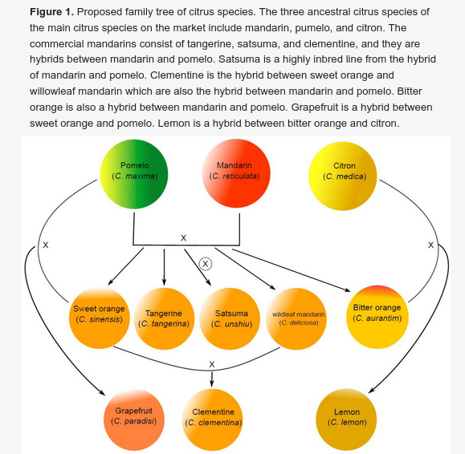

# Homework 03

The deadline of this homework is on **Tuesday, 26th of April, 23:59:00 UTC+2**.

This week's homework will test your grasp of some of the more advanced concepts of Python programming. You will have to solve a single large task centered mostly on Object-Oriented Programming (OOP) as described in the lecture. As always, you will pass the homework if the `pytest` passes both on your local system and online for all tasks.

For this task, you will need to work on the following files:

- `citrus.py`: Definition of a class `Citrus` that represents a citrus plant
- `garden.py`: Definition of a class `Garden` that represents a garden that can hold plants
- `simulate.py`: Simulate a `Garden` full of `Citrus` plants over time.

The files `test_citrus.py` and `test_garden.py` are going to test if the code in `citrus.py` and `garden.py` provides the desired functionality. `simulate.py` is mostly there for you to try out your code.

Do not forget to activate your environment before starting work on your code.

## Class Citrus

In `citrus.py`, define a class `Citrus`, which is supposed to represent a single citrus plant.

`Citrus` should have a single instance attribute `species` of type `str`.

Furthermore, `Citrus` should overwrite four _dunder_ methods:

1. The constructor `__init__`
2. The string representation `__str__`
3. The left addition function `__add__`
4. The right addition function `__radd__`

We will use `__init__` to initialize the `species` attribute, `__str__` to make sure that the plant has a sensible representation when printed, and `__add__` and `__radd__` to implement the crossing operation for two `Citrus` plants, which and yields a new `Citrus` child object.

### \_\_init\_\_

This function initializes the species of the `Citrus`. It should have two keyword arguments:

1. Keyword argument `species` should have a default value `None`
2. Keyword argument `possible_species` should have as default value a tuple of the three ancestral citrus species "Pomelo", "Mandarin", "Citron"

If the keyword argument `species` has the value `None`, the instance attribute `species` should be selected randomly among `possible_species`. Otherwise the instance attribute `species` should have the same value as the keyword argument `species`.

**Hint:** You can implement a random selection by calling the function `random.choice` on an iterable. The `random` module is already imported for your convenience. You can learn more about `random` [here](https://docs.python.org/3/library/random.html).

### \_\_str\_\_

Use the `__str__` method to generate a representation following these examples:

- `<Citrus of species Pomelo>`
- `<Citrus of species Mandarin>`
- `<Citrus of species Citron>`

The text should be dependent on the instance attribute `species`. This is also the text that will be printed when calling `print` on a `Citrus` instance.

### \_\_add\_\_

The `__add__` method will be used to define the behaviour when adding two `Citrus` objects with the `+` operator. This operator is supposed to implement a crossover operation, representing the genetic crossing of two citrus plants. This will generate a child object of `class Citrus`.

The species of the child object is determined by chance as well as by the genetic citrus family tree shown below:

The above figure was taken from the recent paper _Citrus Taste Modification Potentials by Genetic Engineering_ (full citation [here](citrus_family_tree_citation.bib)). However, this does not mean that the crossover functionality in the code has to be scientifically accurate. On the contrary, it is only supposed to be a very simplistic approximation.

In practice, the citrus family tree means that the crossover operation called with the `+` operator should obey the following rules:

1. If one of the objects is not of type `Citrus`, a `TypeError` is raised
2. If the two objects are the same species, the child will be the same species
3. If the two objects are of species _Pomelo_ and _Mandarin_, the child species will be chosen randomly among _Sweet Orange_, _Tangerine_, _Satsuma_, _Wildleaf Mandarin_ and _Bitter Orange_
4. If the two objects are of species _Pomelo_ and _Sweet Orange_, the child species will be _Grapefruit_
5. If the two objects are of species _Sweet Orange_ and _Wildleaf Mandarin_, the child species will be _Clementine_
6. If the two objects are of species _Citron_ and _Bitter Orange_, the child species will be _Lemon_
7. If the two objects are of different species and no crossover rule is defined, the child species will be chosen randomly among the parent species

Try to make the `TypeError` informative. At the very least be sure to mention the word _plant_ (this will be tested for).

### \_\_radd\_\_

The `__radd__` method is only called when the object to the left of the operator `+` is a non-`Citrus`, for which the crossover operation is undefined. Therefore you can simply raise a `TypeError` when the method is called. Try to make the `TypeError` informative. At the very least be sure to mention the word _plant_ (this will be tested for).

If you have implemented everything correctly, `simulate.py` should now execute without errors up to line 13.

## Class Garden

In `garden.py`, define a class `Garden`, which is supposed to represent a garden that can be filled with `Citrus` plants.

`Garden` should have a single instance attribute `plants` which is of type `list`.

Furthermore it will have five methods:

1. `__init__`
2. `__len__`
3. `__str__`
4. `plant`
5. `cross`

The constructor `__init__` initializes the instance attribute `plants` with an empty `list`. `__len__` returns the current length of that list, which is equal to the number of plants currently in the garden.

### \_\_str\_\_

Use the `__str__` method to generate a representation following these examples:

- `<Garden with 0 plants and 0 species>`
- `<Garden with 5 plants and 3 species>`
- `<Garden with 8 plants and 4 species>`

Next to the number of plants, you will also need to calculate the number of unique species currently in the garden.

**Hint:** Unique values can easily be counted using `set`s

### plant

The method `plant` should have one keyword argument `new_plant` with default value `None`. If this keyword argument has the value `None`, a new `Citrus` object should be appended to the instance attribute `plants` list. Otherwise, the value of `new_plant` is appended to `plants`.

### cross

The method `cross` randomly selects two objects from the `plants` list and applies the crossover operation to them with the `+` operator. The result is planted in the garden using the `plant` method. If there are not at least two objects in the `plants` list, nothing happens.

If you have implemented both `Citrus` and `Garden` correctly, `simulate.py` should now execute fully without errors. You can then try running `pytest`, which tests the functionality of both classes a bit more extensively.

If the `pytest` passes both on your local system and online, then you have passed this homework. Good luck!
