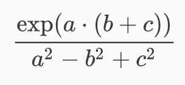

# Homework 4 - Basic NumPy

The deadline of this homework is on **Tuesday, 3rd of May, 23:59:00 UTC+2**.

This homework assignment is a selection of relatively short functions that you are supposed to implement. Template function headers are given in the file `homework_numpy.py`. You may use the full functionality of NumPy, but **no other libraries**.

### 1.1 Expomultiadditive Division

Implement a function `expomultiadditive_division` which takes three positional arguments `a`, `b` and `c`, and returns the result of the following term element-wise:

    

Make sure that your function performs automatic broadcasting when required!

### 1.2 Strange Pattern

You come across this strange pattern.

| x     |       |       | x     |       |       | x     |       |
| ----- | ----- | ----- | ----- | ----- | ----- | ----- | ----- |
|       | **x** |       |       | **x** |       |       | **x** |
|       |       | **x** |       |       | **x** |       |       |
| **x** |       |       | **x** |       |       | **x** |       |
|       | **x** |       |       | **x** |       |       | **x** |
|       |       | **x** |       |       | **x** |       |       |

Mesmerized, you decide you must write a function to generate arbitrary sizes of it. (_Write a function `strange_pattern` that takes a shape tuple `(n, m)` as input and generates a boolean 2D NumPy array with this pattern_)

**Hint:** Perhaps this strange symbol might help? `::`

### 1.3 Dimension Reduction

Write a function `dimension_reduction` that takes a NumPy array of numbers with at least 2, but potentially more dimensions (you do not need to check for this). Apply aggregation functions such that:

1. The first dimension gets reduced to its sum
2. The last dimension gets reduced to its median value

Then, return the standard deviation of the entire array.

### 1.4 Interpolation

You are given a list of `n` (min. 2) floating point numbers and an integer `n_steps`. Write a function `interpolate` that takes this list as an input and returns a NumPy array of size `n_steps * (n - 1) + 1`, where the first and every `n_steps`-th entry afterwards are the original numbers. The other values should be linearly interpolated between those original numbers.

**Example:** `interpolate([2, 3, 4], n_steps=2)` should produce an array like this: `[2. 2.5 3. 3.5 4.]`.

**Hint:** NumPy provides a function that does most of the work for you.

Good luck!
