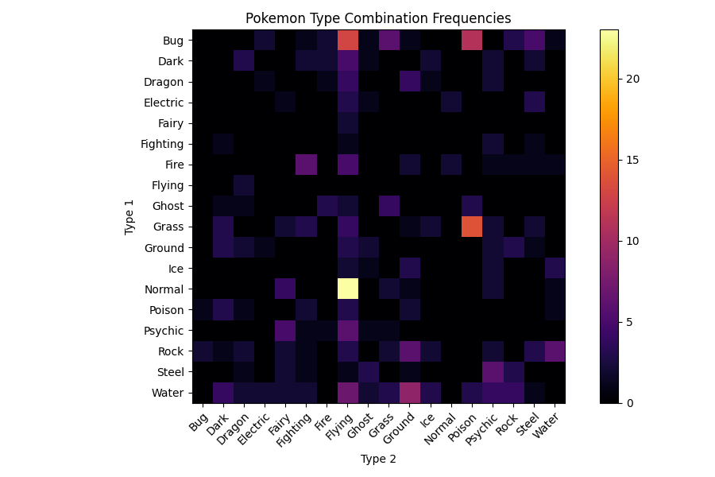
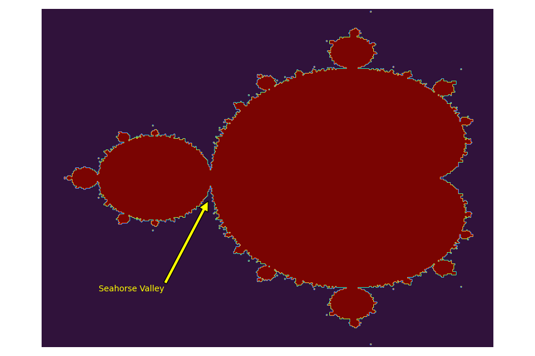

# Homework 5 - Matplotlib

The deadline of this homework is on **Tuesday, 10th of May, 23:59:00 UTC+2**.

This week's homework is all about visualizing data. The resulting plots will not only look pretty, but also demonstrate how figures for scientific publications can be created.

Before you start, make sure your conda environment is activated and that you have all the necessary packages installed (numpy, matplotlib, pytest, pandas).

## A Word about Autograding for Visualizations

Autograding for visualizations is notoriously tricky, because **the produced image can have slight variations** depending on what operating system (Linux|Windows|MacOS) and what hardware (screen resolution, graphic card, etc.) the code is being run on. In the past, this homework was graded by comparing the pixels of the produced images to expected images, but even with a lenient tolerance setting this system led to a lot of frustration.

This year, we are trying something different: We are still providing you with expected images, but **do not compare your output to these images**. Instead we use `pytest` to **check if your code has changed the appropriate attributes** in the `matplotlib` objects that your functions return. For you, that means no changes to the workflow of the previous homeworks.

Hopefully, the changes will make this homework more enjoyable. Still, if you think that your code generates exact outputs but pytest is not working correctly, please contact the tutors.

## This Homework

There are 3 tasks in this homework:

- Plotting Air Quality Data: `airquality.py`
- Making a Custom Heatmap: `heatmap.py`
- Visalizing the Mandelbrot Set: `mandelbrot.py`

In all tasks, you are asked to write a function that returns a `Figure` object of shape `(9, 6)` as well as one or more `Axes` objects. You can use all packages that were introduced so far (`numpy`, `matplotlib`). As always, you have to pass all 3 tests to complete the homework.

**Useful resources:**

- Documentation of `plt`: [matplotlib.pyplot](https://matplotlib.org/stable/api/_as_gen/matplotlib.pyplot.html)
- Documentation of `Axes`: [matplotlib.axes](https://matplotlib.org/stable/api/axes_api.html)
- Documentation of `Figure`: [matplotlib.figure](https://matplotlib.org/stable/api/figure_api.html)

## Task 1 - Plotting air quality data

In this task, you have to implement the function `plot_airquality`, which takes a NumPy array `data` (shape is (2, 31). It contains the concentration of PM2.5 (row 0) and PM10 (row 1) fine dust particles (http://www.npi.gov.au/resource/particulate-matter-pm10-and-pm25) for each day of January 2019 (31 columns) at the Alte Münze in Osnabrück. The data comes from https://airapi.wurmloch.de/.

You will have to create two subplots (2 rows, 1 column), which share the same x-axis (have a look at the `sharex` and `sharey` parameters of the `subplots` function, https://matplotlib.org/3.2.1/api/_as_gen/matplotlib.pyplot.subplots.html#matplotlib-pyplot-subplots). The first subplot should contain two line plots (PM2.5 and PM10) with the days on the x-axis. Label these two line graphs with "PM2.5" and "PM10" respectively and display the legend for the first subplot. Set the first subplot's title to "Absolute fine dust concentration" and its y-axis label to "Concentration".

The second subplot should contain two bar plots, stacked on top of each other (have a look at the `bottom` parameter of the `bar` function, which expects an array-like object, https://matplotlib.org/3.1.1/api/_as_gen/matplotlib.pyplot.bar.html#matplotlib-pyplot-bar). If you are unsure about what that means, you can always take a look at the `expected` directory. The lower bars should show the PM2.5 data and the bars on top should display the amount of PM10 for each day. Set the second subplot's x-label to "Day", the y-label to "Concentration" and the title to "Stacked PM2.5 and PM10".

Finally, set the figure's super-title to "Fine dust concentration in Osnabrück (January 2019)" with a font-size of 16. (Should return figure and 2 axes).

## Task 2 - Making a Custom Heatmap

In this task, we will work with the `Pokemon` data set which is already converted and imported as `freq_values` and `freq_names` in `heatmap.py`. You can find it in [data/pokemon_no_duplicates.csv](data/pokemon_no_duplicates.csv).

Your task is to write a function `make_heatmap` that creates a heatmap of the frequencies of `Type 1` and `Type 2` combinations of pokemons. More high-level packages such as [seaborn](https://seaborn.pydata.org/) have specialised functions for that, but we will do it with pure `matplotlib`. The resulting plot should look like this:

Here are some steps that can be followed to solve this task:

1. Create the necessary `Figure` and `Axes` objects
2. Plot the quadratic data with pairwise combination counts using `imshow` with the colormap `inferno`
3. Set the necessary labels and title for the `Axes` object
4. Create a colorbar on the right side of the plot
5. Set the labels with `Type 1` and `Type 2`
6. Return the `Figure` object and one `Axes` object

## Task 3 - Visualizing the Mandelbrot Set

In this task, we will visualize the famous [Mandelbrot Set](https://en.wikipedia.org/wiki/Mandelbrot_set). For this, you are given a function `mandelbrot` that returns a boolean array representing a rectangular view of the Mandelbrot Set. The resulting plot should look like this:

The `mandelbrot` function accepts positional and keyword arguments. You can leave the keyword arguments at their default value and use `x`, `y`, `dx`, `dy` to specify which part of the Mandelbrot Set will be visualized. `x` and `y` determine the upper left corner, `dx` and `dy` the offset from that point along the respective axis. We are interested in the main corpus, which lies between the locations `(-1.5, 1.0`) and `(0.5, -1.0)`.

Here are some steps that can be followed to solve this task:

1. Create the necessary `Figure` and `Axes` objects
2. Create the Mandelbrot boolean array using `mandelbrot`
3. Plot the Mandelbrot data with the colormap `turbo`
4. Create an `annotation` that points out the beautiful [Seahorse Valley](http://www.alunw.freeuk.com/seahorsevalley.html) at `(147, 170)`
5. Turn off the unneeded axis of the plot
6. Return the `Figure` object and one `Axes` object

**Bonus:** Play around with the keyword parameters of `mandelbrot`. At which setting is the Seahorse Valley the most beautiful?
