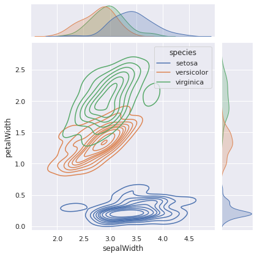

# Homework 08

The deadline of this homework is on **Tuesday, 7th of June, 23:59:00 UTC+2**.

This week's homework is all about visualizing data again.

## A Word about Autograding for Visualizations

Autograding for visualizations is notoriously tricky, because **the produced image can have
slight variations** depending on what operating system (Linux|Windows|MacOS) and what hardware
(screen resolution, graphic card, etc.) the code is being run on. In the past, this homework
was graded by comparing the pixels of the produced images to expected images, but even with a
lenient tolerance setting this system led to a lot of frustration.

This year, we are trying something different: We are still providing you with expected images,
but **do not compare your output to these images**. Instead we use `pytest` to **check if your
code has changed the appropriate attributes** in the `matplotlib` objects that your functions return. For you, that means no changes to the workflow of the previous homeworks.

Hopefully, the changes will make this homework more enjoyable. Still, if you think that your code generates exact outputs but pytest is not working correctly, please contact the tutors.

## **Task - Density**

In this task you will use `seaborn`.
Write a function `make_densityplot(iris)`
that displays the joint density of `sepalWidth` and `petalWidth` for each species, plus the marginal
density of the two variables on the side of the plot. The marginals densities should be shaded.
There is a `seaborn` **figure level** function that does this for you with very little configuration.
It is important that you use the figure level function. Otherwise the autograding will fail.
Consult the function's documentation to find out how to achieve the exact
customizations.

> Good luck!
